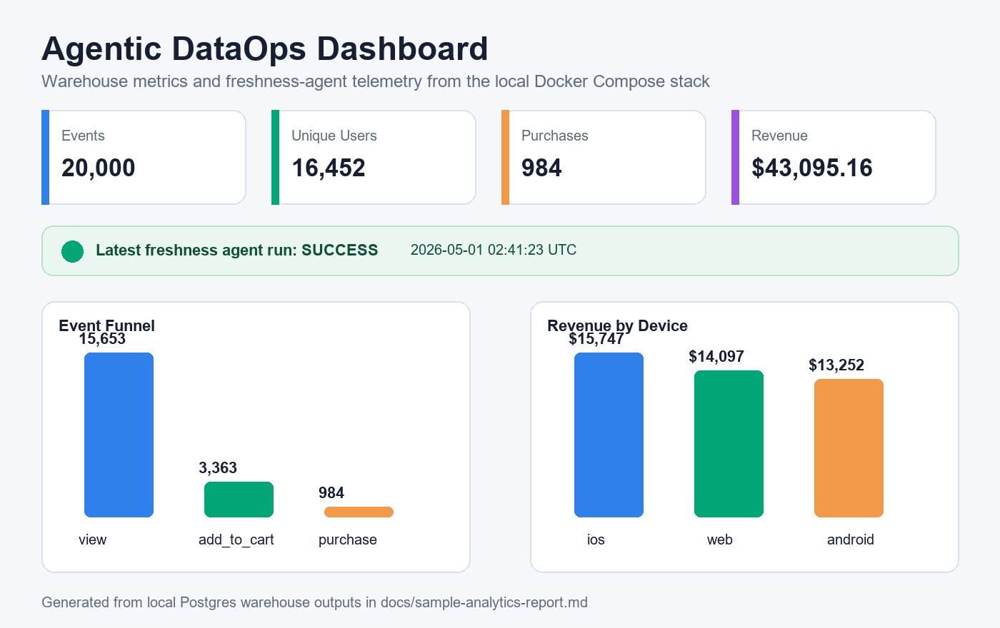
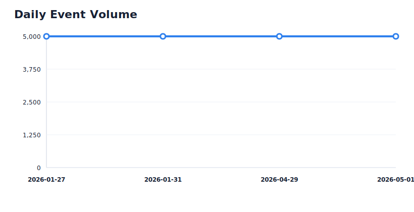
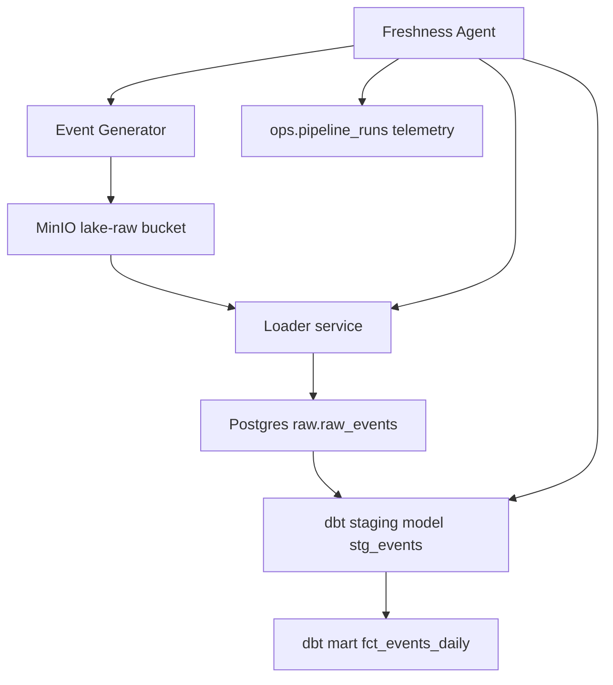

# Agentic DataOps Platform

[](https://github.com/efazHossain/agentic-dataops/actions/workflows/validate.yml)

Local-first data platform that simulates a production analytics pipeline with object storage, a warehouse, dbt transformations, data freshness checks, and an automated remediation agent.

This project is designed as a portfolio-grade data engineering demo: it shows how raw event data moves through lake storage, ingestion, transformation, validation, and operational telemetry using Docker Compose.

## Portfolio Summary

Built a local DataOps platform that detects stale data, remediates the pipeline, rebuilds dbt models, validates data quality, logs telemetry, and serves analytics outputs through generated reports and a Streamlit dashboard.

## Screenshots



The dashboard summarizes warehouse volume, unique users, purchase revenue, agent health, event funnel, and revenue by device. The generated analytics report also includes reusable chart assets:



## What This Demonstrates

- End-to-end data pipeline design with MinIO, Postgres, Python, and dbt
- Local S3-compatible object storage and warehouse separation
- Incremental analytics modeling with dbt
- Source freshness checks and dbt data tests
- Automated remediation when a pipeline becomes stale
- Operational logging into an `ops` schema
- A reproducible developer workflow through Docker Compose and Make

## Tech Stack

| Category | Tools |
|---|---|
| Programming | Python, SQL |
| Containers | Docker, Docker Compose |
| Object Storage | MinIO |
| Warehouse | PostgreSQL |
| Transformation | dbt |
| Monitoring | Python freshness agent |
| Data Quality | dbt tests, dbt source freshness |
| Dashboarding | Streamlit, generated SVG report assets |
| DevOps | Makefile, GitHub Actions |

## Architecture



## Components

- **MinIO**: local S3-compatible object storage for generated JSONL event partitions
- **Postgres**: warehouse with `raw`, `staging`, `mart`, and `ops` schemas
- **dbt**: staging, mart, tests, freshness checks, and docs
- **Python generator**: writes synthetic event partitions to MinIO
- **Python loader**: reads the latest JSONL partition and upserts events into Postgres
- **Freshness agent**: runs dbt freshness checks, remediates stale data, and logs outcomes
- **Streamlit dashboard**: visualizes event funnel, revenue, daily volume, mart rows, and agent telemetry
- **Makefile**: short commands for the happy path demo

## Project Structure

```text
infra/
  postgres/init/        Postgres schemas and warehouse tables
  minio/init/           MinIO bucket helper script
services/
  generator/            Synthetic event generation
  loader/               JSONL ingestion into Postgres
  dbt/                  dbt project, models, tests, and profile
  dashboard/            Streamlit dashboard over warehouse outputs
  agent/                Freshness detection and remediation workflow
data/sample/            Notes for sample data usage
docs/demo-proof.md      Verified remediation run output
docs/sample-analytics-report.md
                        Example warehouse metrics and SQL
docs/dbt-docs.md        dbt docs and lineage instructions
docs/assets/            Generated SVG report charts
scripts/generate_report.py
                        Generates report assets from local warehouse data
docker-compose.yml      Local infrastructure and tool services
Makefile                Developer workflow shortcuts
```

## Quickstart

### 1. Configure Environment

```bash
cp .env.example .env
```

### 2. Run the Demo Path

```bash
make demo
```

This starts the core services, generates one event partition, loads it into Postgres, runs dbt models, and runs dbt tests.

### 3. Exercise the Agent

```bash
make agent
```

The agent runs `dbt source freshness`. If the source is stale, it generates a new partition, finds the latest object in MinIO, loads it into Postgres, runs dbt models and tests, checks freshness again, and logs the result.

### Demo Proof

A verified agent run is captured in [docs/demo-proof.md](docs/demo-proof.md). In that run, the agent detected stale freshness, generated and loaded `5000` events, rebuilt dbt models, passed all `8` dbt tests, and confirmed freshness passed afterward.

### Sample Analytics Output

Example warehouse metrics are captured in [docs/sample-analytics-report.md](docs/sample-analytics-report.md), including total events loaded, purchase revenue, device performance, latest mart rows, and the SQL used to produce the report.

Generate fresh SVG report assets from the local warehouse:

```bash
make report
```

### Dashboard

Start the Streamlit dashboard:

```bash
make dashboard
```

Open:

```text
http://localhost:8501
```

### dbt Docs

Generate and serve dbt documentation:

```bash
make dbt-docs-generate
make dbt-docs-serve
```

More detail is available in [docs/dbt-docs.md](docs/dbt-docs.md).

### 4. Validate Configuration

```bash
make validate
```

This checks the Docker Compose configuration and runs `dbt parse` in the dbt container.

## Useful Commands

```bash
make up          # Start Postgres, MinIO, and bucket initialization
make generate    # Generate a JSONL event partition in MinIO
make load        # Load the latest generated partition into raw.raw_events
make dbt-run     # Run dbt transformations
make dbt-test    # Run dbt tests
make agent       # Run freshness remediation agent
make test        # Run Python unit tests
make psql        # Open psql in the Postgres container
make buckets     # List MinIO buckets
make reset       # Stop services and remove Docker volumes
```

## Data Model

### `raw.raw_events`

Raw event stream loaded from MinIO JSONL files. Important fields include:

- `event_id`
- `user_id`
- `event_type`
- `event_ts`
- `device_type`
- `price`
- `currency`
- `source_version`
- `geo_country`
- `campaign_id`
- `ingested_at`

### `stg_events`

Typed and normalized staging model over the raw event stream.

### `fct_events_daily`

Incremental mart model aggregating event counts and purchase revenue by:

- `event_day`
- `device_type`
- `event_type`

## Observability

The platform records operational outcomes in `ops.pipeline_runs`.

Example query:

```sql
SELECT run_id, pipeline_name, status, started_at, ended_at
FROM ops.pipeline_runs
ORDER BY started_at DESC;
```

The project also includes dbt source freshness checks and dbt model tests for core integrity checks.

## Design Decisions

- **Local-first**: every core component runs through Docker Compose for reproducibility.
- **Warehouse/lake separation**: generated events land in MinIO before being loaded into Postgres.
- **dbt-centered modeling**: transformations, tests, freshness, and docs live in one analytics project.
- **Incremental mart**: daily event metrics use an incremental strategy keyed by day, device, and event type.
- **Agentic remediation**: the agent turns freshness failures into a concrete remediation workflow instead of only alerting.

## Current Roadmap

- Expand CI from configuration checks to a full Docker integration demo
- Add Python unit tests for generator and loader behavior
- Add a small dashboard or generated report from the mart table
- Add richer data quality checks for volume anomalies and revenue drift
- Add Dagster orchestration once the core workflow is fully validated
