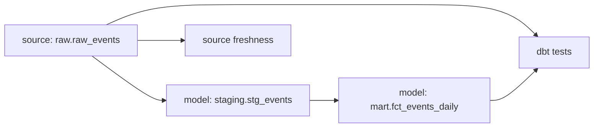

# dbt Documentation and Lineage

The dbt project lives in `services/dbt` and documents the transformation layer from raw event data to analytics-ready marts.

## Generate dbt Docs

```bash
make dbt-docs-generate
```

This writes dbt documentation artifacts into `services/dbt/target`.

## Serve dbt Docs Locally

```bash
make dbt-docs-serve
```

Open:

```text
http://localhost:8085
```

## Lineage



## Models

| Model | Materialization | Purpose |
|---|---|---|
| `staging.stg_events` | View | Type and normalize raw event rows from `raw.raw_events`. |
| `mart.fct_events_daily` | Incremental table | Aggregate daily event counts and purchase revenue by device and event type. |

## Tests and Freshness

- Source tests validate `event_id` uniqueness and non-null event timestamps.
- Mart tests validate non-null grain and metric fields.
- Source freshness checks use `raw.raw_events.ingested_at` to detect stale pipeline state.
