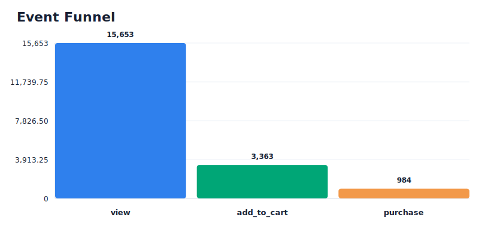
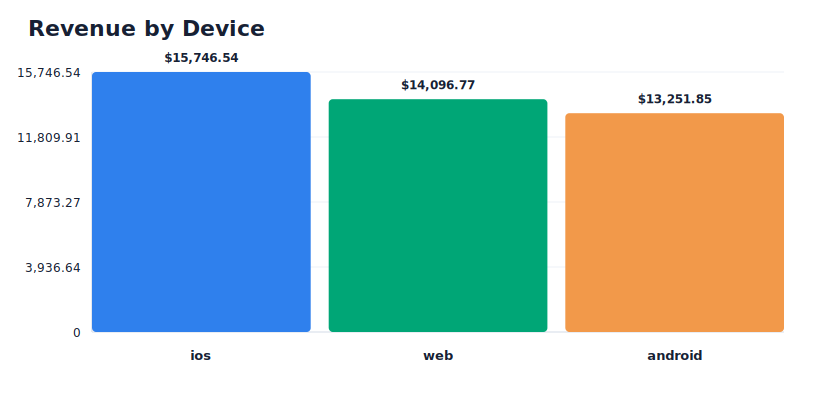
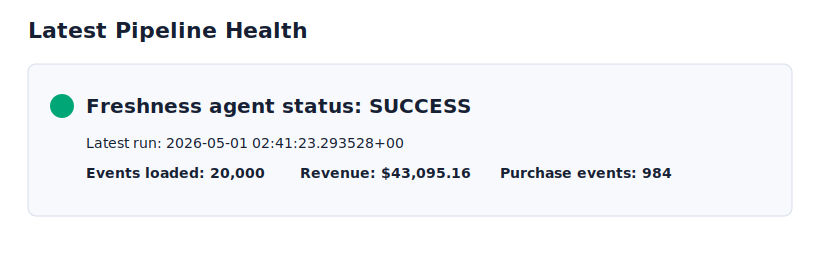

# Sample Analytics Report

This report shows example warehouse outputs after running the local demo and freshness agent. It is intended as a portfolio artifact: the pipeline does not just move data, it produces queryable analytics tables and operational status.

Report generated from local Postgres warehouse on 2026-05-01.

## Generated Charts








## Executive Summary

| Metric | Value |
|---|---:|
| Total events loaded | 20,000 |
| Unique users | 16,452 |
| Purchase events | 984 |
| Simulated purchase revenue | $43,095.16 |
| First event date | 2026-01-27 |
| Latest event date | 2026-05-01 |
| Latest agent status | SUCCESS |

## Event Funnel

| Event type | Event count | Revenue |
|---|---:|---:|
| view | 15,653 | $0.00 |
| add_to_cart | 3,363 | $0.00 |
| purchase | 984 | $43,095.16 |

## Device Performance

| Device type | Event count | Revenue |
|---|---:|---:|
| ios | 6,725 | $15,746.54 |
| web | 6,710 | $14,096.77 |
| android | 6,565 | $13,251.85 |

## Latest Mart Rows

The `mart.fct_events_daily` model aggregates daily metrics by date, device, and event type.

| Event day | Device type | Event type | Event count | Revenue |
|---|---|---|---:|---:|
| 2026-05-01 | web | view | 1,321 | $0.00 |
| 2026-05-01 | ios | view | 1,303 | $0.00 |
| 2026-05-01 | android | view | 1,277 | $0.00 |
| 2026-05-01 | ios | add_to_cart | 283 | $0.00 |
| 2026-05-01 | android | add_to_cart | 274 | $0.00 |
| 2026-05-01 | web | add_to_cart | 268 | $0.00 |
| 2026-05-01 | web | purchase | 102 | $4,708.98 |
| 2026-05-01 | ios | purchase | 91 | $3,944.09 |
| 2026-05-01 | android | purchase | 81 | $3,594.19 |
| 2026-04-29 | web | view | 1,360 | $0.00 |

## Operational Telemetry

The freshness agent records run status in `ops.pipeline_runs`.

| Run id | Pipeline | Status | Started at |
|---|---|---|---|
| freshness-agent-11cfdd5c-5337-4500-b58b-a6d52ffc50ea | freshness_agent | SUCCESS | 2026-05-01 02:41:23 UTC |
| freshness-agent-b11930e6-1e75-4df3-9a88-df170987a335 | freshness_agent | SUCCESS | 2026-05-01 02:38:03 UTC |

## SQL Used

```sql
SELECT
  COUNT(*) AS total_events,
  COUNT(DISTINCT user_id) AS unique_users,
  COUNT(*) FILTER (WHERE event_type = 'purchase') AS purchase_events,
  COALESCE(SUM(price) FILTER (WHERE event_type = 'purchase'), 0) AS purchase_revenue,
  MIN(event_ts)::date AS first_event_date,
  MAX(event_ts)::date AS latest_event_date
FROM raw.raw_events;
```

```sql
SELECT
  event_type,
  COUNT(*) AS event_count,
  COALESCE(SUM(price) FILTER (WHERE event_type = 'purchase'), 0) AS revenue
FROM raw.raw_events
GROUP BY event_type
ORDER BY event_count DESC;
```

```sql
SELECT
  device_type,
  SUM(event_count) AS event_count,
  SUM(revenue) AS revenue
FROM mart.fct_events_daily
GROUP BY device_type
ORDER BY event_count DESC;
```

```sql
SELECT
  run_id,
  pipeline_name,
  status,
  started_at,
  ended_at
FROM ops.pipeline_runs
ORDER BY started_at DESC
LIMIT 5;
```
